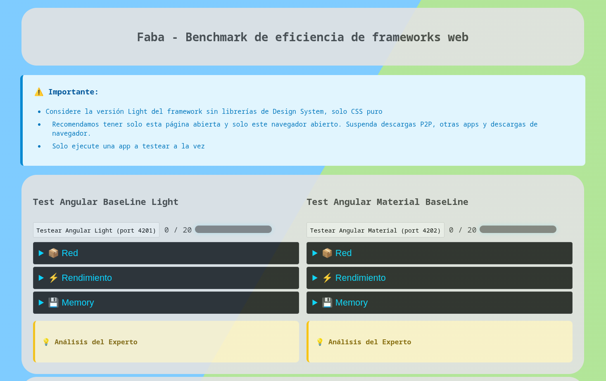
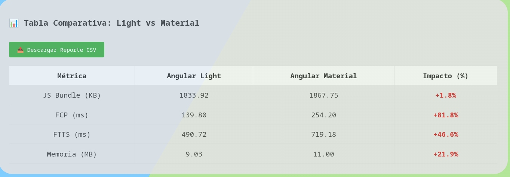

# Faba — Benchmark: Comparativa de Frameworks y Eficiencia Digital. 
> Cuantificando el impacto real del stack tecnológico en la inclusión digital y la sostenibilidad.

## Autor
### Fabián Catalán
- Github: https://github.com/fabocv
- LinkedIn: https://www.linkedin.com/in/fkatv
---

**¿Por qué una aplicación construida con la misma lógica presenta variaciones sustanciales de peso entre frameworks?**

Más allá de medir tiempos de carga, Faba caracteriza el impacto técnico del stack frontend en escenarios de carga en frío.

## **📖 Elige tu nivel de profundidad:**
- **¿Eres Diseñador, PM o curioso por la Sostenibilidad?** 👉 Lee nuestra [Guía Esencial (Sin tecnicismos)](docs/esencial.md)

  Descubre cómo el "equipaje digital" afecta la batería de tus dispositivos y al planeta.

- **¿Eres Desarrollador, Arquitecto o Auditor Técnico?** 👉 Explora la [Metodología Detallada](docs/methodology.md)
  
  Rigor estadístico ($M=20$), auditoría de Long Tasks y el cálculo del Índice de Eficiencia Relativa.

---

## El Desafío: El "Sesgo de la Fibra Óptica" e Impuesto tecnológico
La mayoría de las aplicaciones modernas se diseñan en condiciones perfectas: computadoras potentes y conexiones a internet ultrarrápidas. Esto crea un espejismo que nos impide ver la realidad del usuario común: el **Impuesto Tecnológico**.

Cada herramienta que añadimos al desarrollo tiene un costo que el usuario paga con su tiempo y su batería antes de poder usar la app. **Faba** hace visible este costo invisible mediante tres pilares:

1. **La Espera (Carga)**: Lo que tarda en bajar la app a tu dispositivo.

2. **El Esfuerzo (Procesamiento)**: Qué tanto tiene que trabajar tu dispositivo para entender el código.

3. **La Frustración (Bloqueo)**: Esos segundos donde la pantalla se ve bien, pero no responde a tus clics.

---

## ¿Cuál es el impacto del rendimiento cuando todo anda veloz? 
El rendimiento siempre ha importado, pero hoy el escenario ha cambiado:

1) **Responsabilidad Ambiental**: La eficiencia digital es ahora un pilar de la sostenibilidad corporativa (Green UX). Un código optimizado reduce el consumo energético de los centros de datos y dispositivos móviles.

2) **Inclusión Digital**: El hardware de gama media/baja ya no puede seguir el ritmo del crecimiento exponencial del JavaScript, así lo señala Según Alex Rusell en [*The State of the Web*](https://infrequently.org/2021/03/the-performance-inequality-gap/). Por otro lado, la reducción en milisegundos del renderizado aumenta las tasas de conversión en países en desarrollo, según [*WPO Stats*](https://wpostats.com/), un ejemplo de lo anterior es Pinterest, que redujo el tiempo de espera en un 40% y aumentó sus ingresos publicitarios en un 44%. Esto prueba que el hardware lento "expulsa" a los usuarios de la economía digital si la web es pesada. El rendimiento no es un lujo, es una condición necesaria para la inclusión digital en un mercado global diverso.

3) **Impuesto del tiempo de ejecución** El tamaño del bundle (js comprimido) es engañoso, pues la experiencia de usuario (la espera) es el parseo y la compilación del mismo. EN hardware de gama media-baja es linealmente más lento, creando barreras de acceso ([The Cost of JavaScript - V8 Blog / Andy Osmani](https://v8.dev/blog/cost-of-javascript-2019)).

4) **Madurez Técnica**: Existen alternativas reales (Astro, Svelte, Qwik, Vanilla) que se consideran ligeras y nuevas vs. los frameworks más maduros 'tradicionales de la industria'. ¿habrá diferencia de rendimiento considerable antes de escoger un stack para desarrollar aplicaciones web eficientes?. Misko Hevery, creador de Angular, ahora en Qwik; explica que el modelo tradicional de frameworks está 'roto' para la web moderna porque obliga a ejecutar el mismo código dos veces (server y cliente). Este proyecto busca cuantificar ese 'impuesto de hidratación' comparando implementaciones reales. Puedes leer más en [Resumability vs Hydration By Miško Hevery](https://www.builder.io/blog/resumability-vs-hydration). 

--- 

## ¿Qué hace Faba exactamente? 

Faba se especializa en el Cold start (Carga en frío). No medimos navegación de larga duración, sino el *costo de entrada*.

Bajo un entorno **Headless controlado**, ejecutamos aplicaciones funcionalmente idénticas (1000 registros de datos estáticos) para auditar:

- **Equipaje (Red):** Datos transferidos y conteo de peticiones.

- **Esfuerzo (CPU):** Tiempo de ejecución de JS y saturación del hilo principal.

- **Estabilidad (FTTS):** Nuestra métrica propia, el *Faba Time To Stability*, que detecta cuándo la app es realmente usable tras 300ms de calma total en el procesador.

---

## Rigurosidad

Para garantizar que los resultados sean indiscutibles, aplicamos:

- **Aislamiento Total**: Sin librerías externas de medición, solo APIs nativas del navegador.
- **Estabilidad Estadística**: Cada escenario se repite 20 veces ($M=20$) con limpieza total de caché entre turnos para eliminar el ruido.
- **Línea Base Vanilla**: Comparamos todo contra una versión en Vanilla JS para conocer el costo mínimo inevitable del navegador.

| Framework	| version | baseline-light	| design-system-heavy |
|-----------|---------|-----------------|---------------------|
| Angular | Faba v1.1	|CSS plano / utilitario | 	Angular Material |
| React | Faba v1.1	|CSS plano / utilitario	 | Material UI (MUI) |
| VanillaJS | Faba v1.1 | CSS plano / utilitario | Material Web Components|
| Svelte | Faba v1.1 |CSS plano / utilitario | 	Svelte Material UI |
| Vue 3* |Faba v1.2 |CSS plano / utilitario	 | Vuetify |
| SolidJS* | Faba v1.2	|CSS plano / utilitario | 	Material Web Components |

> (*) Disponibles para la Versión 1.2+

## Medimos la primera impresión de los frameworks

Si tu equipo ya invierte en accesibilidad y diseño responsable, Faba es el validador técnico de esos valores. No buscamos "frameworks ganadores", sino decisiones informadas.

*"Faba mide costos técnicos reales del frontend moderno utilizando prácticas estándar de benchmarking de sistemas, priorizando comparabilidad y transparencia."*

---

## Reflexión: El Rendimiento como Compromiso Social

Faba es una herramienta diseñada para construir una web sustentable (que consume menos recursos) y sostenible (que perdura en el tiempo).

Es nuestro deber como ingenieros seleccionar stacks y librerías que colaboren con la **sustentabilidad energética**. Mediante la cuantificabilidad del costo de ejecución de nuestras aplicaciones, podemos garantizar la **sostenibilidad social** de las mismas. Esto se traduce en:

- **Eficiencia Energética**: Reducir el tiempo de CPU (como el salto de 484ms a 721ms observado en nuestras pruebas) baja directamente el consumo de vatios por usuario.

- **Perdurabilidad**: Apps que no fuerzan la obsolescencia programada del hardware de gama media y baja.

- **Inclusión Digital**: Interfaces accesibles para todas y todos, independientemente de su capacidad adquisitiva o su ubicación geográfica.

## Documentación adicional

- 📄 Metodología completa: [`methodology.md`](docs/methodology.md)
- 📊 Ejemplos de resultados: carpeta `/results`
- 🧪 Apps evaluadas: carpeta `/apps`

---

# Faba Benchmark v1.1 - Guía de Instalación y Uso

Este monorepositorio contiene un entorno de pruebas automatizado para medir la eficiencia de renderizado en aplicaciones Angular (Versión Ligera vs. Angular Material).

## 📋 Requisitos Previos
Antes de comenzar, asegúrate de tener instalado:

- Node.js (Versión 18 o superior recomendada)
- Angular CLI (npm install -g @angular/cli)
- Google Chrome (Puppeteer lo utilizará para las pruebas)

## 🛠️ Instalación
1. Clonar el proyecto y entrar en la raíz:

```
cd Faba-Front-Bench/
```
2. Instalar las dependencias globales del proyecto: Desde la raíz, instala el orquestador y las utilidades de limpieza:

```
npm install
```

3. Instalar dependencias de cada aplicación: Debes instalar los módulos de cada carpeta para que puedan ejecutarse:
```
# Angular Light
cd apps/angular-test && npm install && cd ../..

# Angular Heavy
cd apps/angular-test-heavy && npm install && cd ../..

# Controlador
cd apps/controller-vanillajs && npm install && cd ../..
```

## Uso del Benchmark

### 1. Iniciar el Entorno
Para levantar las dos aplicaciones de Angular y el controlador simultáneamente, ejecuta en la raíz:

```
npm run start:all
```
- Angular Light: Se ejecutará en http://localhost:4201
- Angular Heavy: Se ejecutará en http://localhost:4202
- Controlador: Se abrirá automáticamente en http://localhost:3000

### 2. Ejecutar las Pruebas
1. Una vez abierto el panel en el navegador, asegúrate de no tener otras pestañas pesadas abiertas.

2. Haz clic en "Testear Angular Light". El sistema realizará 20 iteraciones automáticas.

3. Al finalizar, haz clic en "Testear Angular Material".

4. Al obtener ambos resultados, se generará una Tabla Comparativa automática con el impacto porcentual.

### 3. Exportar Resultados
Haz clic en el botón "Descargar Reporte CSV" para obtener un archivo con todas las métricas de rendimiento (FCP, FTTS, Memoria y Bundle) para tu análisis de tesis.

### Limpieza y Errores
Si al intentar iniciar el proyecto recibes un error de "Puerto en uso" o quieres cerrar todo rápidamente, ejecuta:

```
npm run clean
```

## Metodología de Medición (Faba v1.1)
- **Warm-up:** Se recomienda ignorar la primera corrida si el ruido ($\sigma$) es > 100ms.
- **Muestreo:** Cada test consta de 20 muestras promediadas.
- **Estabilidad ($\sigma$):** Se busca una desviación estándar inferior a ±50ms para considerar la prueba válida.

## Pantallas v1.1


Primer prototipo funcional de Faba v1.1 - Angular tests


Resultados comparativos de Angular sin design system (light) y con MUI (heavy) bajo headless controlado y con $M=20$